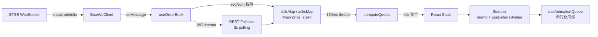

# BTSE OrderBook

实时显示 BTSE 永续合约 `BTCPFC` 的盘口数据（前 8 档买/卖盘 + 最新成交价），用 Next.js + TypeScript + Tailwind CSS 实现。

## 功能特性

- **WebSocket 实时数据流**：订阅 BTSE 的 `update:BTCPFC`（盘口增量）与 `tradeHistoryApi:BTCPFC`（成交价）两个 topic
- **增量更新**：服务端只推送 delta，前端维护 `Map<price, size>` 做 in-place 修改
- **seqNum 校验**：检测到序号断层立即重新订阅并拉取新 snapshot，避免数据漂移
- **REST 兜底**：WS 长时间无消息（30s）或主动失败时切换到 REST 轮询
- **闪烁动画队列**：高频更新时把新进档位串行化展示，视觉上保持 1-4 行同时闪烁
- **节流渲染**：150ms 内的多次 delta 合并为一次 `setState`，但底层 Map 保持实时
- **可见区 diff**：跳过深层档位变化引起的无用渲染
- **Tick size 聚合**：下拉切换 0.1 / 0.5 / 1 / 5 / 10 精度，按"对用户更不利"方向取整聚合
- **页面 title 同步**：把最新价同步到浏览器 tab，切走后仍可监盘
- **WS 健康指示器**：右上角圆点显示 connecting / healthy / reconnecting / disconnected
- **断网/切 tab 自恢复**：监听 `online` 和 `visibilitychange`，恢复时主动重订阅
- **Error Boundary**：捕获子树异常，展示降级 UI 而不是白屏
- **无障碍**：`role="region"`、`aria-live`、`aria-label` 完整；`prefers-reduced-motion` 关闭闪烁

## 架构数据流



**关键设计**：

1. **三层数据结构**：原始 Map（写）→ Quote 数组（读）→ React state（渲染）。三者之间用 `flushToState` 单向同步。
2. **prev 镜像**：用 `useRef` 持有上一帧的 quotes，仅在 delta 路径下更新；snapshot 时清空，避免首屏全部触发动画。
3. **节流 ≠ 丢数据**：节流只是合并 render，每条 delta 都会立即写入底层 Map，最终值正确。
4. **聚合方向**：买盘向下取整（不显示更高的虚假价），卖盘向上取整（不显示更低的虚假价），避免聚合误导用户。

## 运行

```bash
npm install
npm run dev
```

打开 http://localhost:3000

## 测试

```bash
# 单元 + 集成测试（Vitest + React Testing Library）
npm test          # 一次性运行
npm run test:watch

# E2E 测试（Playwright）
npx playwright install chromium  # 首次需下载浏览器
npm run test:e2e
npm run test:e2e:ui              # 带 UI 的调试模式
```

**测试覆盖**：

- `test/orderBookUtils.test.ts` — 纯函数：`applyDelta` / `computeQuotes` / `aggregateByTick` / `visibleQuotesEqual`
- `test/useAnimationQueue.test.ts` — hook 时序：队列消费节奏、卸载清理
- `test/useOrderBook.test.tsx` — hook 集成：snapshot/delta、seqNum 断层重订阅、节流、tick 切换
- `e2e/orderbook.spec.ts` — E2E：mock WebSocket，断言首屏 + title + tick 切换

## 代码质量

```bash
npm run lint           # ESLint
npm run format         # Prettier 格式化全部
npm run format:check   # 检查不写盘
```

提交前 `lint-staged` 会自动跑 `eslint --fix` + `prettier --write`（由 Husky pre-commit 触发）。
首次启用：

```bash
git init
npm install   # 自动触发 husky prepare
```

## 目录结构

按 **feature-folder + shared 基础设施** 组织，业务自治、基础设施可复用：

```
.
├── app/                                Next.js App Router 入口
│   ├── layout.tsx                      根布局 + metadata
│   ├── page.tsx                        动态导入 OrderBook（ssr:false）
│   ├── providers.tsx                   React Query Provider
│   └── globals.css                     Tailwind + 闪烁动画 + reduced-motion
├── api/                                外部数据访问层（顶级，跨 feature 共享）
│   └── btse.ts                         BTSE REST 接口封装 + RestOrderBookSnapshot 类型
├── features/                           业务域
│   └── orderbook/
│       ├── index.ts                    对外只暴露 OrderBook 主组件
│       ├── components/                 OrderBook / SideList / LastPrice / Header
│       │                               LoadingSkeleton / WsIndicator
│       │                               TickSizeSelector / ErrorBoundary
│       ├── hooks/
│       │   ├── useOrderBook.ts         WS 订阅 + Map 维护 + 节流 flush + tick 聚合
│       │   └── useLastPrice.ts         成交价订阅 + RAF 合并
│       ├── websocket/
│       │   ├── BtseOrderBookClient.ts  盘口单例（BTCPFC 业务配置）
│       │   └── BtseLastPriceClient.ts  成交价单例（BTCPFC 业务配置）
│       ├── utils/
│       │   └── orderBookUtils.ts       applyDelta / computeQuotes / aggregateByTick
│       ├── types.ts                    Quote / OrderBookMessage / SIDE 等常量与类型
│       └── constants.ts                MAX_VISIBLE_QUOTES / TICK_SIZE_OPTIONS
├── shared/                             通用基础设施（跨 feature 复用）
│   ├── hooks/
│   │   ├── useAnimationQueue.ts        闪烁队列
│   │   └── useDocumentTitle.ts         document.title 同步
│   ├── utils/
│   │   └── formatNumber.ts             formatWithCommas / formatPrice / tickDecimals
│   └── websocket/
│       └── BtseWsClient.ts             通用 WS 泛型基类（连接/心跳/重连/分发）
├── test/                               Vitest 单元 + 集成测试
└── e2e/                                Playwright 测试
```

**导入约定**：
- feature 内部互相引用用 **相对路径** (`../types`, `./SideList`)，让 feature 整个文件夹可独立移植
- 跨 feature/shared/api 用 **绝对路径** (`@/shared/...`, `@/api/...`)，跨层依赖一眼可见
- `app/page.tsx` 通过 `import OrderBook from '@/features/orderbook'`，feature 内部细节对路由层隐藏

## 关键性能优化

| 优化点 | 实现 | 收益 |
|--------|------|------|
| 节流 flush | `setTimeout` 150ms 内合并 | 高频 delta 不会每条都 render |
| 可见区 diff | `visibleQuotesEqual` 比较前 8 档 | 深层档位变化不触发渲染 |
| Map in-place 更新 | `applyDelta` 返回新 Map | 避免每次都重建整个数组 |
| `React.memo` SideList | LastPrice 频繁更新时不连累 | 不打断行内动画 |
| `useDeferredValue` | prevQuotes 推迟渲染 | 动画对比降为低优先级 |
| `requestAnimationFrame` | 成交价同一帧多消息合并 | 每帧最多一次 setState |
| Map 末尾 maxTotal | 累计方向固定，O(1) 取值 | 避免 `Math.max(...)` 扫一遍 |

## 设计权衡

- **为什么不是虚拟列表**：固定 8 行 × 28px，DOM 节点稳定，虚拟化反而引入开销
- **为什么 150ms throttle 不是 100ms**：略大于 `FLASH_DURATION`（100ms），确保动画完整播放再触发下一帧
- **为什么 prev 用 ref 不是 state**：prev 只服务于动画检测，不需要独立的渲染时机；与 quotes 必须时序对齐
- **为什么 snapshot 不触发动画**：snapshot 是全量数据，所有行都算"新"会导致整片闪烁，体验糟糕
